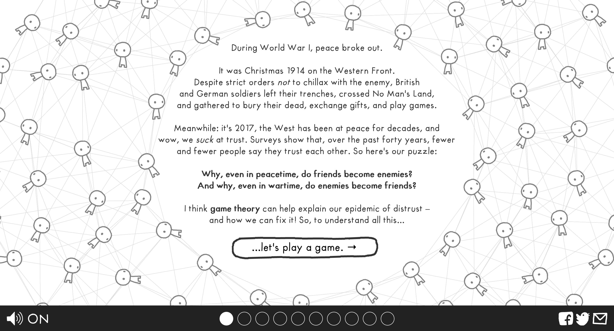
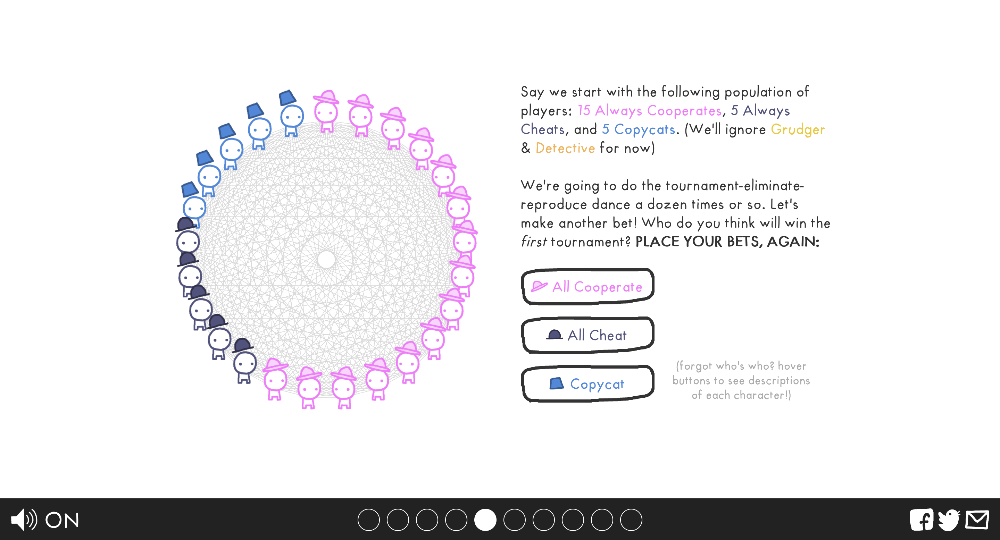
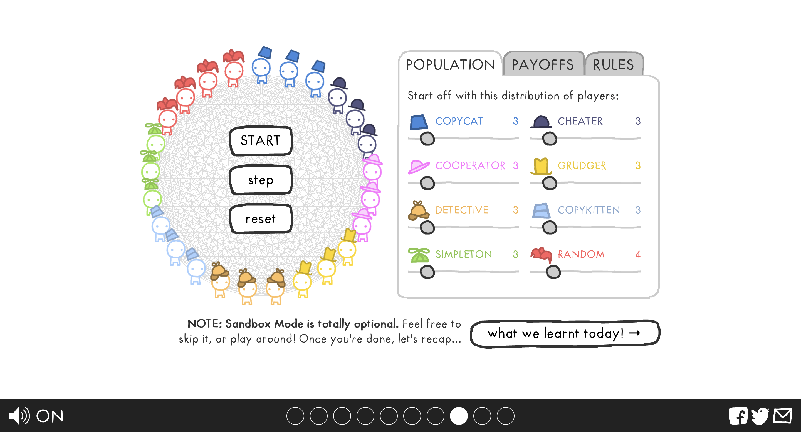

# The Evolution of Trust — visual references

Three screenshots from Nicky Case's [The Evolution of Trust](https://ncase.me/trust/), supplied as visual references for this skill. Open and look at each image before planning or building.

Look for generous white space, friendly handwritten type, simple expressive characters, and hand-drawn controls. Color connects the characters, prose, and controls so the explanation and the playable feel like one scene. Carry that approachable, playful feel into a design suited to the topic.

## Story and invitation

The surrounding network frames a spacious reading area. A clear question and one prominent button lead into play.

## Prediction beside the model

The diagram has room to breathe. Matching colors and hats link the population to the prose and prediction buttons; the choice belongs beside the model it concerns.

## Open sandbox

The same visual language carries into a richer interface. Controls sit beside or inside the simulation, with clear labels and a visible way to continue after exploring.
